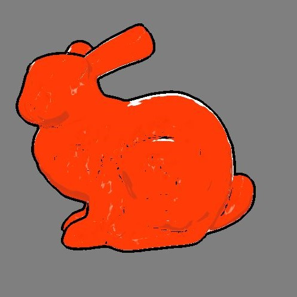
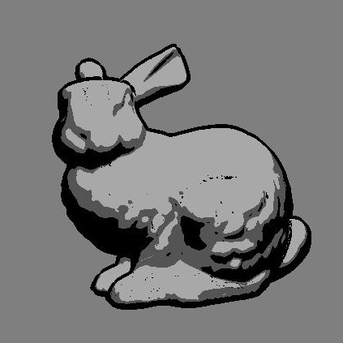

# cel-shader
## Description
A cel-shading effect applied to .obj models written in OpenGL and C++.  
Uses two types of cel-shading: a naive approach using the diffuse light component and an extended toon shader (known as "x-toon" shading).

## Gallery
<p float="left">
  
   
  
</p>

## How to Build
```
cd part1
python3 build.py
```

## How to Run
This project requires an object file (.obj) and a texture file (.ppm). The texture file is used for the x-toon shading. For example:
``` 
./project.exe ../common/objects/bunny2.obj ../common/textures/back/backlight1.ppm
```

## Interactivity
* Press the R key to rotate the object  
* Press the W and S keys to move the camera up and down  
* Scroll wheel zooms in and out of the object  
* Press X to toggle x-toon shading with the given texture  
* Press O to toggle the outline  
* Press D to toggle the y-coordinate of the texture mapping (this alters the x-toon shading effect)

## The X-Toon Shading Effect
The paper that describes x-toon shading covers 3 types of effects that can be accomplished based on the type of texture supplied and the calculation in the vertex shader used to determine the y-coordinate of the texture mapping (the x-coordinate is the normalized diffuse light component).  
The 3 effects (which are controlled by the D key) are as follows in this order:
1. Depth of Field
2. Backlighting
3. Specular Highlights  

Note that these effects are created by the texture, not by any extra light sources.

## Attributions
* X-toon shading paper: https://hal.inria.fr/inria-00362888/document/
* Textures: https://github.com/andrerogers/XToonShader/tree/master/ExtendedToonShader/Texture
* Naive shading: https://www.cs.rpi.edu/~cutler/classes/advancedgraphics/S12/final_projects/hutchins_kim.pdf


